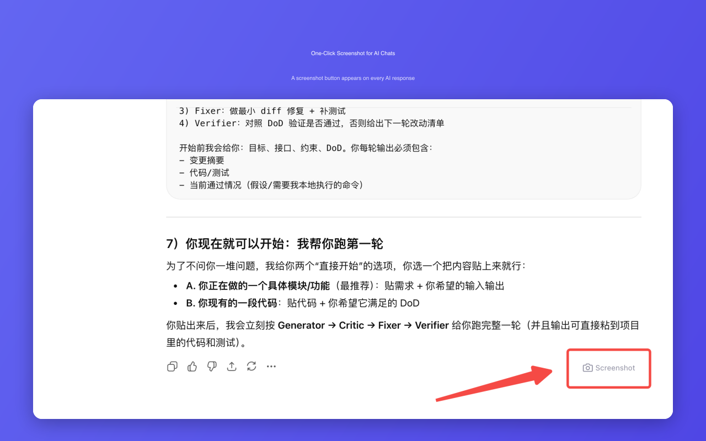

# ChatShot - AI Chat Screenshot

One-click screenshot for ChatGPT, Claude, Doubao conversations. Capture AI chat to clipboard instantly.



## What it does

A small **Screenshot** button appears at the bottom of every AI response. Click it, and your question + the AI's full answer are captured as one clean image — automatically copied to your clipboard.

## Supported Platforms

| Platform | URL |
|----------|-----|
| ChatGPT | chatgpt.com / chat.openai.com |
| Claude | claude.ai |
| Doubao (豆包) | doubao.com |

## Features

- Captures full Q&A conversation as one image
- Handles long responses — no content cut off
- Auto-copies to clipboard — paste anywhere with Cmd/Ctrl+V
- Clean watermark with platform name & timestamp
- Retina-quality 2x resolution
- 100% local & private — no data uploaded, no account needed

## Install

**From Chrome Web Store:**

[ChatShot on Chrome Web Store](https://chrome.google.com/webstore/) *(link TBD after review)*

**From source:**

```bash
git clone https://github.com/BENZEMA216/chatshot.git
cd chatshot
npm install
npm run build
```

Then load `dist/` as an unpacked extension in `chrome://extensions/`.

## Tech Stack

- **Manifest V3** Chrome Extension
- **TypeScript** + **Vite** (IIFE build for content scripts)
- **html2canvas** for DOM-to-image rendering
- **Platform Adapter Pattern** — each chatbot site has its own DOM selector adapter

## Architecture

```
src/
├── content.ts     # Main entry: MutationObserver + button injection
├── adapters.ts    # Platform adapters (ChatGPT, Claude, Doubao)
└── capture.ts     # Screenshot engine (html2canvas + canvas stitching)
```

Key design decisions:
- **In-place capture** — elements are rendered in their original DOM context (no cloning), then stitched together via Canvas API
- **Scroll ancestor expansion** — before capture, all `overflow:hidden` ancestors are temporarily set to `overflow:visible` so html2canvas sees the full content
- **IIFE bundle** — content scripts can't use ES modules in older Chrome, so Vite builds as a self-contained IIFE

## Development

```bash
npm run dev        # Watch mode
npm run build      # Typecheck + production build
npm run typecheck  # TypeScript check only
```

## Privacy

ChatShot does NOT collect, store, or transmit any user data. Everything runs locally in your browser. See [Privacy Policy](PRIVACY_POLICY.md).

## License

MIT
